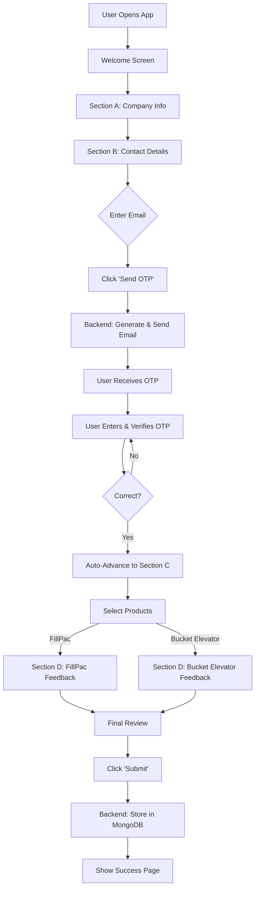

# Project Architecture

This document describes the high-level architecture and data flow of the Beumer Feedback Form application.

## 🏗️ Architectural Overview

The application follows a standard **Client-Server** architecture:

1.  **Frontend (Client)**: A Single Page Application (SPA) built with vanilla HTML, CSS, and JavaScript. It handles user interactions, form validation, and communicates with the backend via RESTful API calls.
2.  **Backend (Server)**: A FastAPI application that serves the frontend files and provides API endpoints for OTP generation, verification, and feedback storage.
3.  **Database**: A MongoDB Atlas cluster used to store the submitted feedback data.
4.  **Email Service**: Gmail SMTP used for sending OTP codes to users.

## 💻 Technologies Used

### Frontend
- **HTML5 & CSS3**: Semantic structure and modern glassmorphism UI design.
- **JavaScript (ES6+)**: Custom state management, dynamic page transitions, and API integration.
- **Google Fonts (Inter)**: Typography for a clean, premium look.

### Backend
- **Python 3.11+**: Core programming language.
- **FastAPI**: Modern, high-performance web framework for building APIs.
- **Uvicorn**: Lightning-fast ASGI server implementation.
- **Motor**: Asynchronous Python driver for MongoDB.
- **Pydantic**: Data validation and settings management using Python type annotations.
- **python-dotenv**: Loads environment variables from `.env` files.

### Infrastructure
- **MongoDB Atlas**: Fully-managed cloud-native database service.
- **Gmail SMTP**: Reliable email delivery service for OTP verification.
- **Render**: Cloud platform for hosting the backend and static files.

## 🔄 System Flowchart



## 🛠️ Data Flow: OTP Verification

1.  **Request**: Frontend sends email to `/api/send-otp`.
2.  **Generation**: Backend generates a 6-digit code and stores it in memory with a 10-minute expiry.
3.  **Transit**: Backend sends the code via SMTP to the user's email.
4.  **Verification**: User submits the code to `/api/verify-otp`.
5.  **Validation**: Backend checks the code against the in-memory store. Returns success and clears the OTP.

## 🗄️ Database Schema (MongoDB)

Feedback is stored as JSON documents in the `feedback` collection.

```json
{
    "sectionA": {
        "country": "India",
        "companyName": "Example Corp",
        "plantLocation": "Mumbai"
    },
    "sectionB": {
        "name": "John Doe",
        "designation": "Manager",
        "contact": "1234567890",
        "email": "john@example.com"
    },
    "sectionC": {
        "products": ["FillPac"],
        "fillPac": { ... },
        "bucketElevator": { ... }
    },
    "sectionD_FillPac": { ... },
    "sectionD_BucketElevator": { ... },
    "created_at": "ISODate"
}
```

---

