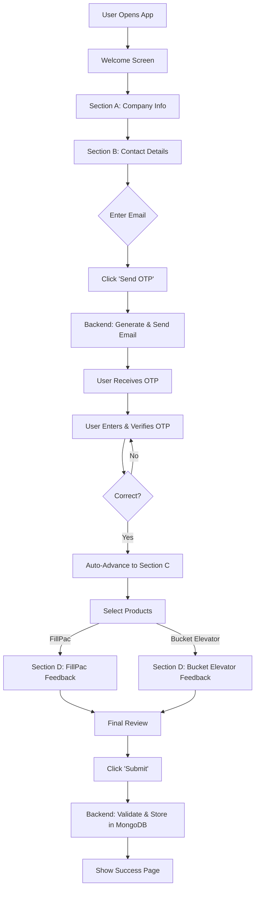

# Project Architecture

This document describes the high-level architecture and data flow of the Beumer Feedback Form application.

## 🏗️ Architectural Overview

The application follows a modern **Serverless Client-Server** architecture:

1.  **Frontend (Client)**: A Single Page Application (SPA) built with vanilla HTML, CSS, and JavaScript. It handles user interactions, form validation, and communicates with the backend via RESTful API calls.
2.  **Backend (Server)**: A FastAPI application deployed as a **Vercel Serverless Function**. It serves the static frontend and provides dedicated API endpoints.
3.  **Database**: A MongoDB Atlas cluster used for persistent feedback storage.
4.  **Email Service**: Gmail SMTP for secure OTP delivery.

## 💻 Technologies Used

### Frontend
- **HTML5 & CSS3**: Responsive structure with a premium glassmorphism UI.
- **JavaScript (ES6+)**: Custom state management and asynchronous API integration.
- **Assets**: Official BEUMER Group branding and custom favicons.

### Backend
- **Python 3.12**: Core runtime on Vercel.
- **FastAPI**: High-performance asynchronous web framework.
- **Motor**: Non-blocking Python driver for MongoDB.
- **Pydantic**: Robust data validation and serialization.

### Infrastructure
- **Vercel**: Global edge network and serverless computing platform.
- **MongoDB Atlas**: Fully-managed cloud database.
- **Gmail SMTP**: Reliable transactional email service.

## 🔄 System Flowchart



## 🛠️ Data Flow: OTP Verification

1.  **Request**: Frontend POSTs email to `/api/send-otp`.
2.  **Generation**: Backend generates a 6-digit code and stores it in an in-memory dictionary with a 10-minute TTL.
3.  **Transit**: Backend sends the code via SMTP (STARTTLS/SSL) to the user.
4.  **Verification**: User submits the code to `/api/verify-otp`.
5.  **Validation**: Backend validates against the store and clears the record upon success.

## 🗄️ Database Integration

### Secure Connection Logic
The application implements a robust **URI Escaping Utility** in `api/index.py` to handle complex MongoDB passwords.
- **Manual Parsing**: Identifies the host separator (`@`) reliably, even if the password contains special characters.
- **Credential Escaping**: Uses `urllib.parse.quote_plus` to ensures RFC 3986 compliance.
- **Masked Logging**: Automatically masks sensitive credentials in server logs.

### Schema (MongoDB)
Feedback is stored as JSON documents in the `feedback` collection:
```json
{
    "sectionA": { ... },
    "sectionB": { ... },
    "sectionC": { "products": ["FillPac"], ... },
    "sectionD_FillPac": { ... },
    "created_at": "ISODate"
}
```

---

